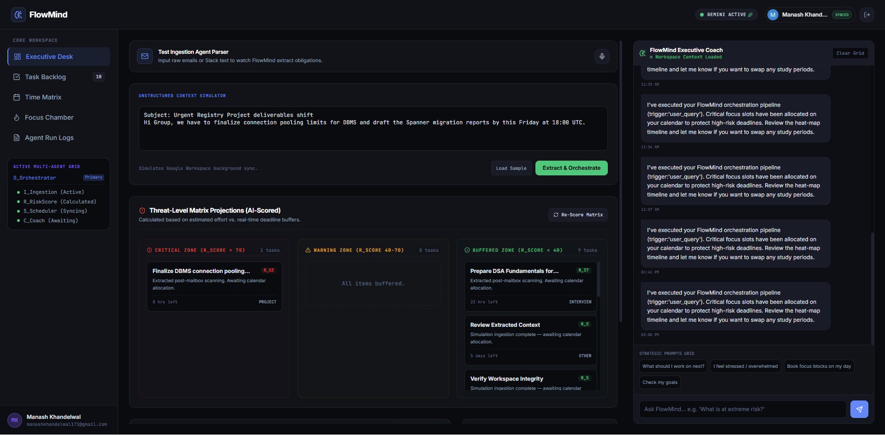
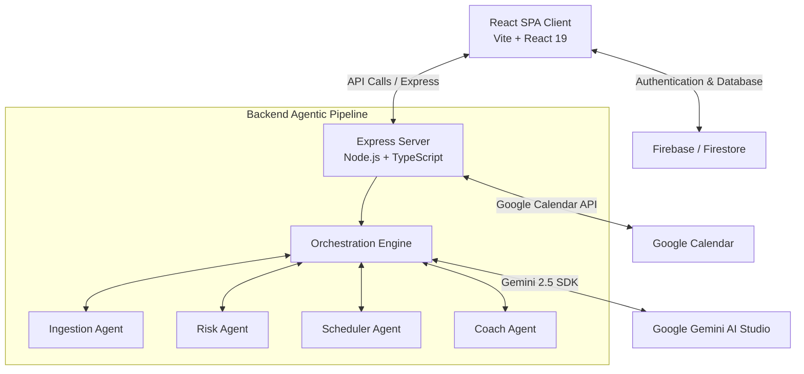

# ✨ FlowMind AI
### The Last-Minute Life Saver

> AI-powered productivity workspace that proactively prevents missed deadlines through autonomous scheduling, intelligent risk prediction, and multi-agent planning.



<p align="center">
  <a href="https://flowmind-ai-266105687127.us-central1.run.app/">Live Demo</a>
  •
  <a href="#architecture--technology-stack">Architecture</a>
  •
  <a href="#-core-features">Features</a>
</p>

<p align="center">
  
  
  
  
  
  
  
  
</p>

---

## 🏆 Resolving "The Last-Minute Life Saver" Challenge

Traditional productivity apps rely on passive alerts that are easy to ignore. FlowMind AI transforms task management from a checklist into an **autonomous partner** that works with you:
- **Active Prioritization**: Continuously evaluates calendar commitments, task weights, and deadlines to identify high-risk areas.
- **Auto-Mitigation**: Automatically decomposes large objectives, schedules optimal focus blocks directly on your Google Calendar, and restructures your timeline if you fall behind.
- **Voice-First Ingestion**: Translates spoken instructions into complete execution roadmaps with milestones.

---

## ⚡ Core Features

* **🖥️ Executive Dashboard**: A centralized control center providing a high-level view of your current workload risk levels, priority breakdown, and a daily voice-narrated briefing.
* **📅 Smart Scheduler**: Generates optimized time blocks for tasks and syncs them automatically to your Google Calendar.
* **🎙️ Voice-to-Task**: Speak your tasks out loud. FlowMind's ingestion pipeline extracts tasks, deadlines, and categories automatically.
* **🔥 Priority Heat Map**: Visualizes tasks using AI-powered urgency scores so you know what is critical and what is safe.
* **🩹 Smart Recovery Mode**: If a deadline is missed, FlowMind reorganizes your schedules, bumps critical work, and creates a recovery plan.
* **🧩 AI Task Decomposition**: Automatically breaks complex goals into manageable subtasks with estimated time completions.
* **🧠 Intelligent Risk Engine**: Analyzes your schedule density and deadline pressure to flag potential bottlenecks before they happen.
* **⏱️ Focus Chamber**: A dedicated Pomodoro-enabled workspace loaded with progress tracking and interactive milestones to keep you on task.
* **📜 AI Agent Activity Logs**: Complete transparency with execution logs showing token usage, agent decisions, and API response speeds.
* **🤖 Multi-Agent Intelligence**: Dedicated, specialized AI agents collaborating dynamically to manage your workspace.
* **📰 Daily AI Briefing**: A personalized executive summary each morning detailing key focus items, overdue alerts, and strategic insights.
* **🛡️ Deadline Guardian**: Identifies approaching critical milestones early and suggests schedule adjustments to prevent last-minute workload spikes.

---

## Architecture & Technology Stack

FlowMind AI is designed as a secure, containerized, multi-agent workspace:



### Component Details
1. **Frontend SPA (`src/`)**: A rich, responsive UI utilizing React 19, Tailwind CSS, Motion, and Lucide icons.
2. **Backend Server (`server.ts`)**: Built with Express and esbuild, serving the static bundle in production and managing backend routing.
3. **Multi-Agent Engine (`server/agents/`)**:
   - **Ingestion Agent (`ingestion.ts`)**: Parses unstructured text and voice feeds to extract tasks.
   - **Risk Agent (`risk.ts`)**: Continually calculates stress levels, bottlenecks, and urgency scores.
   - **Scheduler Agent (`scheduler.ts`)**: Generates and manages calendar focus-block schemas.
   - **Coach Agent (`coach.ts`)**: Generates conversational updates, daily briefings, and recovery recommendations.
4. **Firebase Integration**: Authenticates users securely via Google OAuth and hosts active states (tasks, goals, messages) in Firestore.
5. **Runtime Config Injection**: Injects Google Cloud environment variables at load-time to keep the container completely portable and secure.

---

## 💻 Running Locally

### Prerequisites
- Node.js (v20+ recommended)
- A Google Gemini API Key ([Get one at Google AI Studio](https://aistudio.google.com/))
- A Firebase project configured for Firestore and Google Authentication

### 1. Installation
```bash
git clone <repo-url>

cd FlowMind-AI

npm install
```

### 2. Configure Environment Variables
Copy `.env.example` to `.env` and fill in your keys:
```env
GEMINI_API_KEY="your-gemini-key"
VITE_FIREBASE_API_KEY="your-api-key"
...
```

### 3. Run Development Server
```bash
npm run dev
```
Open [http://localhost:3000](http://localhost:3000) in your browser.

---

## 🐳 Docker Local Run
You can run the app inside a container locally:
```bash
# 1. Build the image
docker build -t flowmind-ai .

# 2. Run the container
docker run -d -p 3000:3000 --env-file .env --name flowmind-app flowmind-ai
```

---

## 🚀 Deployment to GCP (Google Cloud Run)

For detailed deployment instructions, including setting up GCP Service Accounts, Docker registries, and handling the Google OAuth testing consent screen, refer to the **[GCP Deployment Guide](docs/deployment_guide.md)**.

---

